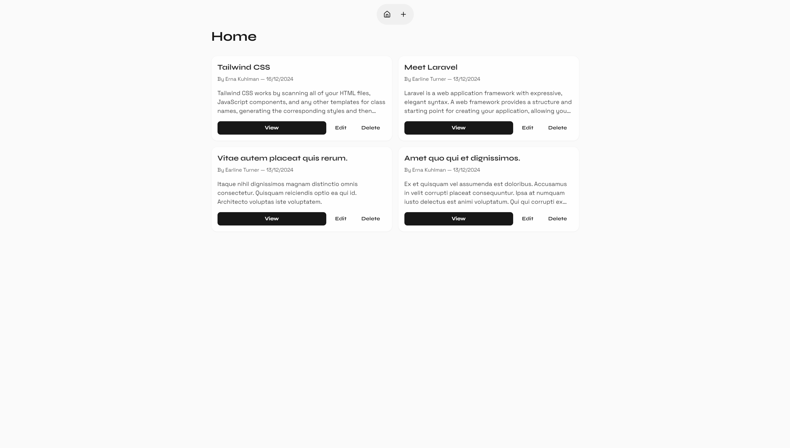

## about this project

This project was created for me to get familiar with PHP and Laravel. It includes basic CRUD operations for posts and users.

<div align="center">
    <div>
        
    </div>
</div>

## setup

1. Install dependencies:

   ```sh
   composer install
   npm install && npm run build
   ```

2. Copy the **.env.example** file to **.env** and configure your environment variables:

   ```sh
   cp .env.example .env
   ```

3. Generate an application key:

   ```sh
   php artisan key:generate
   ```

4. Run migrations:

   ```sh
   php artisan migrate
   ```

5. Start the development server:
   ```sh
   composer run dev
   ```

## usage

- Visit `http://localhost:8000` to see the application in action.
- Use the provided forms to create, edit, and delete posts.
